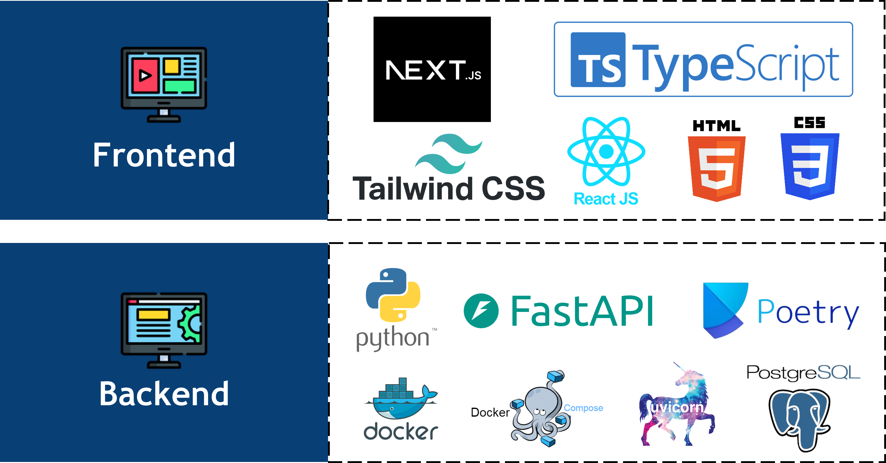
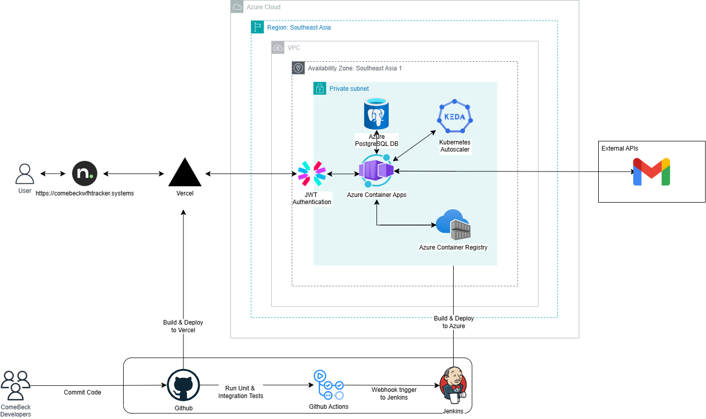

# ComeBeck WFH Tracker 👨🏻‍💻 - IS212 G9T7

```
   ____                     ____            _    
  / ___|___  _ __ ___   ___| __ )  ___  ___| | __
 | |   / _ \| '_ ` _ \ / _ \  _ \ / _ \/ __| |/ /
 | |__| (_) | | | | | |  __/ |_) |  __/ (__|   < 
  \____\___/|_| |_| |_|\___|____/ \___|\___|_|\_\
                                                 
    W F H     M A N A G E M E N T    S Y S T E M
```


[Click here to access ComeBeck WFH Tracker!](https://comebeckwfhtracker.systems/)
## Login Credentials
| Role    | Email                     | Password    |
|---------|---------------------------|-------------|
| HR (1)      | colinmok1000@gmail.com    | password123 |
| STAFF (2)  | colinmok3@gmail.com       | password123 |
| MANAGER (3) | colinmokhengyee@gmail.com | password123 |

For testing purposes, we have inserted all `554 employees` of All In One with the 
same password `password123`. You can use the corresponding email addresses to login. However, please note that certain pages/functionalities are restricted to specific roles.

- `Department Schedule Page` is only accessible to `HR` roles.
- `Pending Arrangements Page` is only accessible to `HR` and `Manager` roles.
- `Withdraw Arrangements Page` is only accessible to `HR` and `Manager` roles.
- `Department Schedule Tab` inside Schedule page is only accessible to `HR` roles.
- `Team Members I Manage Tab` inside Schedule page is only accessible to `MANAGER` roles.

## Table of Contents

- [What is ComeBeck WFH Tracker?](#what-is-comebeck-wfh-tracker)
- [API Documentation](#api-documentation)
- [Getting Started](#getting-started)
- [Overview of Steps to run ComeBeck WFH Tracker Locally](#overview-of-steps-to-run-comebeck-wfh-tracker-locally)
- [Testing Your Code Locally](#testing-your-code-locally)
- [Tech Stack of Comebeck WFH Tracker](#tech-stack-of-comebeck-wfh-tracker)
- [Solution Architecture of Comebeck WFH Tracker](#solution-architecture-of-comebeck-wfh-tracker)
- [Contributors](#contributors)

## What is ComeBeck WFH Tracker
ComeBeck WFH Tracker is an all-in-one work-from-home management platform that enables employees to apply for, view, and manage their remote work arrangements. The platform is designed to be intuitive and efficient, providing a streamlined experience for both employees and managers to coordinate in-office and remote schedules.

Built with the `FastAPI` framework, ComeBeck WFH Tracker offers a fast and scalable backend supported by a `PostgreSQL` database to securely manage user and schedule data. A `React` front-end ensures a responsive and user-friendly interface for all users. In production, the front end is hosted on `Vercel`, while the backend operates in a Dockerized environment on an `Azure Container Apps`, providing a reliable, cloud-based solution for seamless work-from-home tracking and approval workflows.

## API Documentation

The API documentation is served using *Swagger*. You may access it using:

**Hosted Environment:** <https://api.comebeckwfhtracker.systems/api/documentation>

**Local Environment:** <https://localhost:8080/api/documentation>

## Getting Started

**Want to run ComeBeck WFH Tracker locally? Great!** This section guides you through setting up the development environment and describes how to run it on your machine.

**Just want to access ComeBeck WFH Tracker via the web? No problem!** You can skip the local setup and head straight to the deployed version at: [Link To Deployed Site](https://comebeckwfhtracker.systems/)

## Overview Of Steps To Run ComeBeck WFH Tracker Locally

**Required Tools:**

- **`Node.js` (v18.17.0)**: Node.js is a JavaScript runtime environment used for frontend development in this project. You can download and install it from the official website: [Node.js](https://nodejs.org/en/)
- **`Python` (3.12.3)**: Python is the programming language used for the backend development of ComeBeck WFH Tracker with FastAPI. Download and install the Python version 3.12.3 from the official website: [Python](https://www.python.org/downloads/release/python-3123/)
- **`Poetry`**: Poetry is a dependency management and packaging tool for Python. It is used to handle project dependencies and virtual environments in the backend. You can install Poetry by following the instructions on the official website: [Poetry](https://python-poetry.org/docs/)
- **`Docker` (ensure it's running)**: Docker is a containerization platform used to run the backend application. You can find installation instructions and resources on the official website: [Docker](https://www.docker.com/get-started)
- **`Docker Compose` (recommended)**: Docker Compose is a tool for managing multi-container Docker applications. It simplifies running applications with multiple interdependent services. Install instructions can be found on the official website: [Docker Compose](https://docs.docker.com/compose/install/)

**Steps**

1. Clone the repository
2. Navigate to the repository directory
3. Ensure docker is running
4. Setting Up Environment Variables
5. Start the Backend server
6. Start the Frontend server
7. Enjoy ComeBeck WFH Tracker 👨🏻‍💻

### Set Up Environment Variables

To run ComeBeck WFH Tracker locally, you need to create two `.env` files to store sensitive information (secrets).
### Configuring Poetry

1. **Install Poetry**
   
   First, install Poetry if you haven't already. Run the following command in your terminal:
   ```bash
   curl -sSL https://install.python-poetry.org | python -
   ```
   Once installed, add Poetry to your PATH by adding the following line to your shell configuration file (~/.bashrc, ~/.zshrc, etc.):

   ```bash
   export PATH="$HOME/.poetry/bin:$PATH"
   ```
   Reload your shell configuration to make Poetry available:
   ```bash
    source ~/.bashrc
    ```
2. **Install Project Dependencies**

   Navigate to your project directory (where pyproject.toml is located):

   ```bash
   cd path/to/IS212_ComeBeck
   ```
   Then, use Poetry to install dependencies:

   ```bash
    poetry install
    ```
    This command installs all the dependencies required for the backend application to run.

3. **Activate the Virtual Environment**

   To activate the virtual environment created by Poetry, run the following command:

   ```bash
   poetry shell
   ```

   This command activates the virtual environment and allows you to run commands within the environment.
### Overview of the `.env` files needed
- **`.env` file for Frontend:** This file stores environment variables specific to your frontend development environment.
- **`.env` file for Backend:** This file stores environment variables specific to your backend development environment

#### `.env` file for Frontend

1. **Location:** Create a file named `.env` in the root directory of your frontend project. This is the same directory that contains your `package.json` file. The image provides a visual representation of this location.


2. **Content:** The `.env` file should include environment variables specific to 
   your frontend development setup. Here’s an example configuration for <strong><em>development environment</em></strong>:
   ```
    # URL for local development, pointing to the backend server
    NEXT_PUBLIC_API_BASE_URL=http://localhost:<PORT>/api # PORT is usually 8080 unless configured otherwise
   ```
   Replace <PORT> with the port number your backend server is running on, typically 
   8080 during development. Alternatively, for <strong><em>production environment</em></strong>:
    ```
    NEXT_PUBLIC_API_BASE_URL=https://api.comebeckwfhtracker.systems/api/
    ```
#### `.env` file for Backend
1. **Location:** Create a file named `.env` in the root directory of the entire project. This is the same directory that contains your `docker-compose.yml` file. The image provides a visual representation of this location.


2. **Content:** The `.env` file should include environment variables specific to 
your backend development setup. Here’s an example configuration for the <strong><em>development environment</em></strong>:

```
# Development environment variables
CURRENT_ENV=DEV
DATABASE_DIALECT=postgresql
DATABASE_HOSTNAME=localhost
POSTGRES_DB=<POSTGRES_DB>
POSTGRES_USER=<POSTGRES_USER>
POSTGRES_PASSWORD=<POSTGRES_PASSWORD>
POSTGRES_PORT=5432
DEBUG_MODE=true
SMTP_SERVER=smtp.gmail.com
SMTP_PORT=587
SENDER_EMAIL=<SENDER_EMAIL> # Email to send automated notifications about WFH related events 
SENDER_PASSWORD=<SENDER_PASSWORD>
```

For the <strong><em>production</em></strong> environment, replace the database credentials and host information as follows:

```
# Production environment variables
CURRENT_ENV=PROD
PRODUCTION_DB_USER=<PRODUCTION_DB_USER>
PRODUCTION_DB_PASSWORD=<PRODUCTION_DB_PASSWORD>
PRODUCTION_DB_HOSTNAME=comebeck.postgres.database.azure.com
PRODUCTION_DB_PORT=5432
PRODUCTION_DB_NAME=<PRODUCTION_DB_NAME>
SMTP_SERVER=smtp.gmail.com
SMTP_PORT=587
SENDER_EMAIL=<SENDER_EMAIL> # Email to send automated notifications about WFH related events 
SENDER_PASSWORD=<SENDER_PASSWORD>
```

### Start the Backend server

To start the backend server locally and connect to the <strong><em>local database</em></strong> run the following commands

```
docker-compose --profile dev up
```
Alternatively, to start the backend server locally and connect to the <strong><em>production database</em></strong> run the following commands

```
docker-compose --profile prod up
```

### Running Frontend Server

To start the frontend server, run the following command:
```
cd frontend # if you are not already in the frontend directory
npm install # to install the required dependencies
npm run dev # to start the development server
```

## Testing Your Code Locally
> **Note:** All tests for **ComeBeck WFH Tracker** are already executed 
> automatically in our GitHub workflows. This ensures consistent testing on each push and pull request. However, if you’d like to run the tests locally for development purposes or debugging, follow the instructions below.
>
> 

To test ComeBeck WFH Tracker locally, ensure that:
1. The Docker containers for your backend and database services are running.
2. The Poetry-managed virtual environment is activated.

### Activating the Virtual Environment

To run the tests, you must be within the Poetry virtual environment. You can activate it by running:

```bash
poetry shell
```
Once activated, you should see your terminal prompt update to indicate the active virtual environment. It may look something like this:
```
(is-212-wfh-tracking-system-py3.12) PS C:\spm\IS212_ComeBeck>
```
If you’re not in the virtual environment, the tests might fail due to missing dependencies.
### Running the Tests Locally
### Test Types
1. End-to-End Tests
   ```
   pytest tests/EndToEndTests -m "E2ETest" -v
   ```
   These tests simulate real user interactions across the application. This test is executed on our hosted web application https://comebeckwfhtracker.systems/.


2. Integration Tests
   ```
   pytest tests/IntegrationTests -m "integration" -n auto -v
   ```
   Integration tests check the interactions between different components, especially focusing on backend services and database integration. For these tests, the Docker containers for the backend and database should be running, as they verify data flows across services.

3. Unit Tests
   ```
   pytest tests/BackendUnitTests -m "unit" -n auto -v
   ```
   Unit tests validate individual functions and methods, primarily within the backend services, by isolating dependencies. However, a running Docker environment is still required for these tests to ensure configurations are properly loaded.

### Running the Tests Locally
1. Start Docker Containers 

   Ensure that your backend and database containers are running. Use the following command to start them in development mode:
   ```
   docker-compose --profile dev up -d
   ```
   
2. Execute Tests

   Run each test type by executing the respective commands above. If you want to execute all tests sequentially, you can combine them in a shell script or run them individually.


3. Stop Docker Containers

   Once testing is complete, you can stop the Docker containers to free up system resources:
   ```
   docker-compose --profile dev down
   ```
## Tech Stack of ComeBeck WFH Tracker


## Solution Architecture of ComeBeck WFH Tracker


## Contributors

#### G9 Team 7 (Beck)

<table>
    <tr>
        <td align="center"><br/><sub><b>Colin Mok</b></sub></a></td>
        <td align="center"><br/><sub><b>Chester Lim</b></sub></a></td>
        <td align="center"><br/><sub><b>Daryl Yoon</b></sub></a></td>
        <td align="center"><br/><sub><b>Nicholas Goh</b></sub></a></td>
        <td align="center"><br/><sub><b>Joen Tan</b></sub></a></td>
    </tr>
</table>
